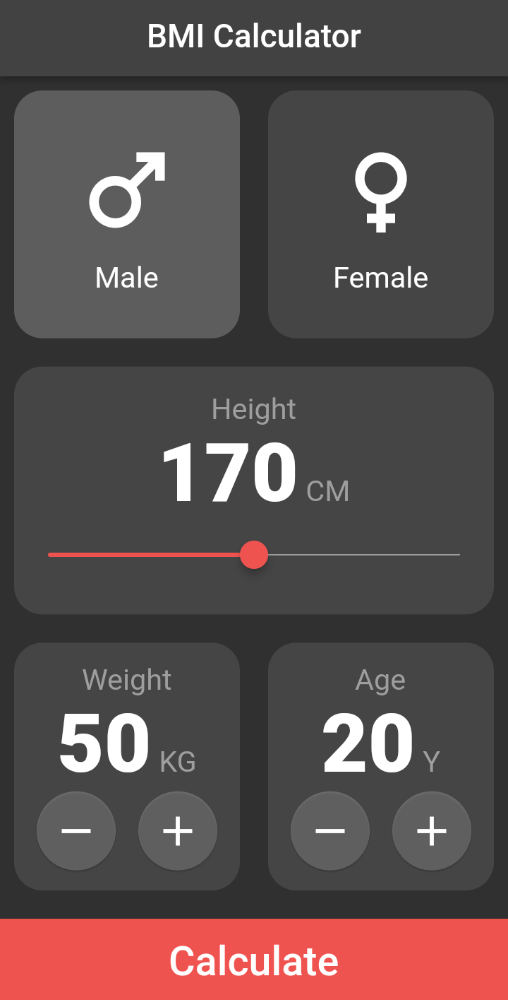

# BMI Calculator

***Flutter*** for Frontend -
***Dart*** for Backend

BMI Calculator enables youto calculate the BMI, that will help you to know how much healthy you are

## Getting started

>   _This Section will introduce you to the first Screen of BMI Calculator_

### Input Screen

_This Screen will demand for several inputs like :_

>Gender 
>Height 
>Weight 
>Age 

_According to these information, it calculates your Body Mass Index (BMI)_ 
_(This uses the basic formula of BMI = (weight)/(height)^2 )_

### Result Screen

_This page shows you your BMI_

### Thanks for Visting here

Follow me on LinkedIn : https://www.github.com/hackbysarthak03

